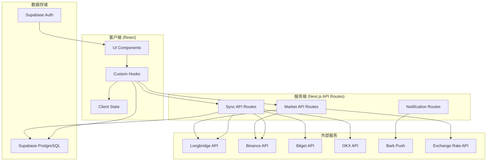
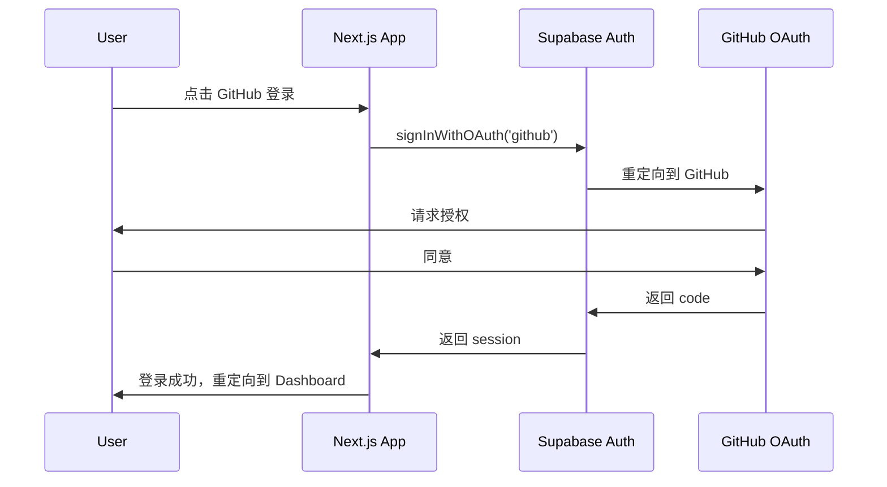

# TradeLens V2 — 技术架构文档

> **版本**：2.0.0-draft  
> **日期**：2026-03-21

---

## 1. 技术栈总览

```
┌─────────────────────────────────────────────────────────┐
│                       Frontend                          │
│  Next.js 16 · React 19 · TailwindCSS 4 · shadcn/ui    │
│  Recharts · next-intl · next-themes                     │
├─────────────────────────────────────────────────────────┤
│                    Backend (BFF)                         │
│  Next.js API Routes (App Router)                        │
│  Server Actions · Route Handlers                        │
├─────────────────────────────────────────────────────────┤
│                      Data Layer                         │
│  Supabase (PostgreSQL + Auth + Realtime + Storage)      │
├─────────────────────────────────────────────────────────┤
│                  External Services                      │
│  Longbridge OpenAPI · Binance API · Bitget API         │
│  OKX API · Bark Push · Exchange Rate API               │
├─────────────────────────────────────────────────────────┤
│                    Deployment                           │
│  Vercel (Web) · GitHub Actions (CI/CD)                  │
└─────────────────────────────────────────────────────────┘
```

### 1.1 核心依赖

| 类别 | 技术 | 版本 | 用途 |
|------|------|------|------|
| 框架 | Next.js | 16.x | SSR/SSG + API Routes |
| UI 库 | React | 19.x | 组件化视图层 |
| 样式 | TailwindCSS | 4.x | Utility-first CSS |
| 组件库 | shadcn/ui + Radix UI | latest | 可访问的 UI 组件 |
| 图表 | Recharts | 3.x | 数据可视化 |
| i18n | next-intl | 4.x | 国际化 |
| 主题 | next-themes | 0.4.x | 多主题管理 |
| 数据库 | Supabase | latest | BaaS (Auth + DB + Realtime) |
| 表格操作 | xlsx | 0.18.x | Excel 导入/导出 |
| 状态管理 | React Context + Hooks | - | 轻量级客户端状态 |
| 测试 | Vitest + Testing Library | latest | 单元/集成测试 |
| E2E 测试 | Playwright | 1.x | 端到端测试 |

### 1.2 新增依赖（V2）

| 包名 | 用途 |
|------|------|
| `longport` | Longbridge OpenAPI SDK (Node.js) |
| `crypto-js` 或 Node.js `crypto` | Bitget/OKX API 签名 |
| `@supabase/auth-helpers-nextjs` | OAuth 流程辅助 |
| `date-fns` 或 `dayjs` | 日期处理（时区、周期计算） |
| `decimal.js` | 高精度金融数值计算 |

---

## 2. 应用架构

### 2.1 目录结构（V2 目标）

```
src/
├── app/
│   ├── [locale]/
│   │   ├── (auth)/                  # 认证相关页面（不带侧边栏布局）
│   │   │   ├── login/
│   │   │   └── register/
│   │   ├── (dashboard)/             # 带侧边栏布局的主应用
│   │   │   ├── layout.tsx           # 侧边栏 + Header 布局
│   │   │   ├── page.tsx             # Dashboard 首页
│   │   │   ├── portfolio/
│   │   │   │   ├── page.tsx         # 持仓列表
│   │   │   │   └── [symbol]/
│   │   │   │       └── page.tsx     # 持仓详情
│   │   │   ├── calculator/
│   │   │   │   ├── page.tsx         # 波段计算器
│   │   │   │   └── options/
│   │   │   │       └── page.tsx     # 期权 Payoff 分析
│   │   │   ├── ledger/
│   │   │   │   ├── page.tsx         # 交易记录
│   │   │   │   ├── funds/
│   │   │   │   │   └── page.tsx     # 资金流水
│   │   │   │   └── duplicates/
│   │   │   │       └── page.tsx     # 去重审核
│   │   │   ├── analytics/
│   │   │   │   └── page.tsx         # 分析报表
│   │   │   └── settings/
│   │   │       ├── page.tsx         # 设置首页
│   │   │       ├── api-keys/
│   │   │       ├── fees/
│   │   │       ├── notifications/
│   │   │       └── preferences/
│   │   └── layout.tsx               # 根布局（主题、i18n 提供者）
│   └── api/
│       ├── sync/
│       │   ├── longbridge/          # Longbridge 数据同步
│       │   ├── binance/             # Binance 数据同步
│       │   ├── bitget/              # Bitget 数据同步
│       │   └── okx/                 # OKX 数据同步
│       ├── market/
│       │   ├── quote/               # 实时行情代理
│       │   └── exchange-rate/       # 汇率查询
│       ├── notifications/
│       │   └── bark/                # Bark 推送
│       └── auth/
│           └── callback/            # OAuth 回调
├── components/
│   ├── layout/
│   │   ├── sidebar.tsx              # 可收缩侧边栏
│   │   ├── header.tsx               # 顶部栏
│   │   ├── mobile-nav.tsx           # 移动端底部导航
│   │   └── breadcrumb.tsx           # 面包屑
│   ├── dashboard/
│   │   ├── kpi-cards.tsx
│   │   ├── net-worth-chart.tsx
│   │   └── recent-trades.tsx
│   ├── portfolio/
│   │   ├── holdings-table.tsx
│   │   ├── position-detail.tsx
│   │   └── view-toggle.tsx          # 整合/分交易所切换
│   ├── calculator/
│   │   ├── trade-calculator.tsx
│   │   ├── options-payoff.tsx
│   │   └── fee-model-selector.tsx
│   ├── ledger/
│   │   ├── transaction-table.tsx
│   │   ├── fund-flow-table.tsx
│   │   ├── duplicate-review.tsx
│   │   └── import-wizard.tsx
│   ├── analytics/
│   │   ├── chart-container.tsx      # 通用图表容器（时间范围选择器）
│   │   ├── pl-curve.tsx
│   │   ├── allocation-pie.tsx
│   │   ├── monthly-bar.tsx
│   │   ├── benchmark-comparison.tsx
│   │   ├── drawdown-chart.tsx
│   │   ├── calendar-heatmap.tsx
│   │   ├── waterfall-chart.tsx
│   │   └── cost-vs-market.tsx
│   ├── settings/
│   │   ├── api-key-manager.tsx
│   │   ├── fee-config.tsx
│   │   ├── bark-config.tsx
│   │   └── preference-panel.tsx
│   └── ui/                          # shadcn/ui 基础组件
├── hooks/
│   ├── use-portfolio.ts             # 持仓数据
│   ├── use-market-data.ts           # 实时行情（统一抽象层）
│   ├── use-analytics.ts             # 分析数据
│   ├── use-sync.ts                  # 数据同步
│   ├── use-notifications.ts         # Bark 通知
│   └── ... (沿用 V1 hooks)
├── lib/
│   ├── calculator/
│   │   ├── stock.ts                 # 股票 P&L 计算
│   │   ├── crypto.ts                # Crypto P&L 计算
│   │   ├── options.ts               # 期权 Payoff 计算
│   │   └── returns.ts               # 收益率计算（TWR/MWR/IRR）
│   ├── exchange/
│   │   ├── longbridge.ts            # Longbridge SDK 封装
│   │   ├── binance.ts               # Binance API 封装
│   │   ├── bitget.ts                # Bitget API 封装
│   │   ├── okx.ts                   # OKX API 封装
│   │   └── types.ts                 # 统一交易记录类型
│   ├── fees/
│   │   ├── models.ts                # 手续费模型定义
│   │   ├── us-stock.ts              # 美股费率
│   │   ├── hk-stock.ts              # 港股费率
│   │   ├── crypto.ts                # Crypto 费率
│   │   └── options.ts               # 期权费率
│   ├── notifications/
│   │   └── bark.ts                  # Bark 推送封装
│   ├── corporate-actions.ts         # 公司行为处理逻辑
│   ├── dedup.ts                     # 去重匹配算法
│   ├── supabase.ts                  # Supabase 客户端
│   └── utils.ts
├── i18n/
│   └── ... (next-intl 配置)
├── types/
│   ├── portfolio.ts                 # 持仓类型定义
│   ├── transaction.ts               # 交易记录类型
│   ├── analytics.ts                 # 分析数据类型
│   └── exchange.ts                  # 交易所通用类型
└── middleware.ts                    # Auth + i18n 中间件
```

### 2.2 数据流架构



### 2.3 实时行情架构

```
┌──────────────┐   WebSocket   ┌──────────────┐
│  Longbridge  │ ────────────> │  Next.js API │
│  Quote WS    │               │  (Proxy)     │
└──────────────┘               └──────┬───────┘
                                      │ SSE / WS
┌──────────────┐   WebSocket   ┌──────▼───────┐
│  Binance WS  │ ────────────> │   Client     │
│  (直连)      │               │   Browser    │
└──────────────┘               └──────────────┘
```

- **Longbridge**：通过 Next.js API Route 做 WebSocket 代理（因为 Longbridge SDK 需要服务端鉴权）
- **Binance/Bitget/OKX**：客户端直连公开 WebSocket 端点（沿用 V1 方案）

---

## 3. 安全架构

### 3.1 认证流程



### 3.2 API Key 安全

- 所有交易所 API Key 在写入数据库前进行 AES-256 加密
- 加密密钥存储在 Supabase 的 `vault` 或环境变量中（不在代码仓库中）
- 前端永远不直接接触 API Secret，所有签名请求在服务端完成
- Longbridge 使用 OAuth 2.0，只存储 refresh_token

### 3.3 数据隔离

- 所有表启用 Row Level Security (RLS)
- 策略：`auth.uid() = user_id`
- 无跨用户数据访问可能

---

## 4. 性能策略

### 4.1 数据加载

| 策略 | 应用场景 |
|------|---------|
| SSR | Dashboard 首屏数据（KPI、持仓概览） |
| CSR + SWR | 实时行情、图表交互 |
| RSC (Server Components) | 静态内容（设置页面、导航） |
| ISR | 汇率数据（每 5 分钟刷新） |

### 4.2 图表优化

- 大数据集使用 `useMemo` 避免重复计算
- 图表组件使用 `React.lazy` + `Suspense` 按需加载
- 时间范围切换时，仅请求对应范围的数据（分页）
- 考虑使用 Web Worker 处理复杂的收益率计算（TWR/IRR）

### 4.3 缓存策略

- 行情数据：内存缓存 + 60s TTL
- 汇率数据：内存缓存 + 5min TTL
- 交易记录：数据库读取 + React Query / SWR 缓存
- 静态资源：Vercel Edge Cache
