# TradeLens V2 — 数据库设计文档

> **版本**：2.0.0-draft  
> **日期**：2026-03-21  
> **数据库**：Supabase (PostgreSQL 15+)

---

## 1. ER 关系图

```mermaid
erDiagram
    users ||--|| profiles : has
    users ||--o{ api_keys : owns
    users ||--o{ transactions : creates
    users ||--o{ fund_flows : creates
    users ||--o{ option_trades : creates
    users ||--o{ corporate_actions : receives
    users ||--o{ calculations : saves
    users ||--o{ duplicate_candidates : reviews
    users ||--o{ notification_config : configures

    profiles {
        uuid id PK
        uuid user_id FK
        text currency_preference
        jsonb fee_config
        text bark_server_url
        text bark_device_key
        jsonb bark_triggers
        text theme
        text language
        boolean sidebar_collapsed
        timestamp updated_at
    }

    api_keys {
        uuid id PK
        uuid user_id FK
        text exchange
        text api_key_encrypted
        text api_secret_encrypted
        text passphrase_encrypted
        text oauth_refresh_token_encrypted
        text label
        text auth_type
        timestamp last_sync_at
        timestamp created_at
    }

    transactions {
        uuid id PK
        uuid user_id FK
        text symbol
        text asset_name
        text asset_class
        text market
        text exchange
        text side
        numeric price
        numeric quantity
        numeric quote_quantity
        numeric commission
        text commission_asset
        text commission_currency
        text source
        text external_trade_id
        text external_order_id
        jsonb custom_fee_override
        text notes
        timestamp transacted_at
        timestamp created_at
    }

    option_trades {
        uuid id PK
        uuid user_id FK
        text underlying
        text option_type
        text direction
        numeric strike_price
        date expiration_date
        numeric premium
        integer contracts
        numeric delta
        numeric gamma
        numeric theta
        numeric vega
        text status
        text exchange
        text source
        text external_trade_id
        text notes
        timestamp transacted_at
        timestamp created_at
    }

    fund_flows {
        uuid id PK
        uuid user_id FK
        text exchange
        text direction
        numeric amount
        text currency
        text notes
        timestamp transacted_at
        timestamp created_at
    }

    corporate_actions {
        uuid id PK
        uuid user_id FK
        text symbol
        text action_type
        numeric amount
        numeric ratio_from
        numeric ratio_to
        text currency
        text exchange
        text source
        timestamp action_date
        timestamp created_at
    }

    calculations {
        uuid id PK
        uuid user_id FK
        text asset_class
        text symbol
        numeric buy_price
        numeric sell_price
        numeric quantity
        numeric profit
        numeric fees
        text type
        jsonb parameters
        timestamp created_at
    }

    duplicate_candidates {
        uuid id PK
        uuid user_id FK
        uuid transaction_id_auto FK
        uuid transaction_id_manual FK
        text status
        numeric similarity_score
        timestamp created_at
        timestamp resolved_at
    }

    notification_config {
        uuid id PK
        uuid user_id FK
        text trigger_type
        numeric threshold_value
        boolean enabled
        timestamp created_at
    }
```



---

## 2. 表详细设计

### 2.1 `profiles` — 用户偏好

> 扩展 Supabase Auth 自动创建的 profiles 表

```sql
-- V2 扩展字段
alter table public.profiles
  add column if not exists currency_preference text default 'USD',
  add column if not exists secondary_currency text default 'CNY',
  add column if not exists fee_config jsonb default '{
    "us_stock": {"commission_per_share": 0.0049, "min_commission": 0.99, "platform_fee": 1.00},
    "hk_stock": {"commission_rate": 0.0003, "min_commission": 3.00, "stamp_duty": 0.0013, "settlement_fee": 0.00002, "trading_fee": 0.00005, "sfc_levy": 0.000027},
    "crypto": {"maker_rate": 0.001, "taker_rate": 0.001},
    "us_options": {"commission_per_contract": 0.65, "platform_fee": 0.50}
  }',
  add column if not exists bark_server_url text,
  add column if not exists bark_device_key text,
  add column if not exists bark_triggers jsonb default '{
    "portfolio_gain_pct": 5.0,
    "portfolio_loss_pct": -3.0,
    "sync_complete": true
  }',
  add column if not exists theme text default 'light',
  add column if not exists language text default 'zh',
  add column if not exists sidebar_collapsed boolean default false,
  add column if not exists updated_at timestamp with time zone default now();
```

### 2.2 `api_keys` — API Key 存储

> 升级 V1 的 api_keys 表，支持多交易所和 OAuth

```sql
-- 重建 api_keys 表
drop table if exists public.api_keys;

create table public.api_keys (
  id uuid default gen_random_uuid() primary key,
  user_id uuid references auth.users on delete cascade not null,
  exchange text not null check (exchange in ('longbridge', 'binance', 'bitget', 'okx')),
  auth_type text not null default 'api_key' check (auth_type in ('api_key', 'oauth')),

  -- API Key 模式 (Binance/Bitget/OKX)
  api_key_encrypted text,
  api_secret_encrypted text,
  passphrase_encrypted text,           -- Bitget/OKX 需要

  -- OAuth 模式 (Longbridge)
  oauth_access_token_encrypted text,
  oauth_refresh_token_encrypted text,
  oauth_expires_at timestamp with time zone,

  label text,
  last_sync_at timestamp with time zone,
  created_at timestamp with time zone default now() not null,

  -- 约束
  unique (user_id, exchange, label)
);
```

### 2.3 `transactions` — 统一交易记录

> V2 核心表：统一存储所有资产类别的交易（除期权外）

```sql
create table public.transactions (
  id uuid default gen_random_uuid() primary key,
  user_id uuid references auth.users on delete cascade not null,

  -- 标的信息
  symbol text not null,                       -- e.g., 'AAPL', 'BTCUSDT', '0700.HK'
  asset_name text,                            -- e.g., 'Apple Inc.', 'Bitcoin'
  asset_class text not null check (asset_class in ('us_stock', 'hk_stock', 'crypto')),
  market text,                                -- e.g., 'NASDAQ', 'HKEX', 'SPOT'
  exchange text not null,                     -- e.g., 'longbridge', 'binance', 'bitget', 'okx'

  -- 交易信息
  side text not null check (side in ('BUY', 'SELL')),
  price numeric not null,
  quantity numeric not null,
  quote_quantity numeric not null,            -- price * quantity (成交额)

  -- 费用
  commission numeric default 0,               -- 佣金
  commission_asset text,                      -- 佣金计价资产
  commission_currency text default 'USD',     -- 佣金对应法币

  -- 来源追踪
  source text not null default 'manual'
    check (source in ('auto', 'manual', 'import')),
  external_trade_id text,                     -- 交易所原始 trade ID
  external_order_id text,                     -- 交易所原始 order ID

  -- 自定义
  custom_fee_override jsonb,                  -- 覆盖全局费率
  notes text,

  -- 时间
  transacted_at timestamp with time zone not null,
  created_at timestamp with time zone default now() not null,

  -- 唯一索引：防止 API 重复导入
  unique (user_id, exchange, external_trade_id)
);

-- 性能索引
create index idx_transactions_user_symbol on public.transactions(user_id, symbol);
create index idx_transactions_user_class on public.transactions(user_id, asset_class);
create index idx_transactions_user_exchange on public.transactions(user_id, exchange);
create index idx_transactions_transacted_at on public.transactions(transacted_at);
```

### 2.4 `option_trades` — 期权交易记录

```sql
create table public.option_trades (
  id uuid default gen_random_uuid() primary key,
  user_id uuid references auth.users on delete cascade not null,

  -- 期权基本信息
  underlying text not null,                   -- 标的代码 e.g., 'AAPL'
  option_type text not null check (option_type in ('CALL', 'PUT')),
  direction text not null check (direction in ('BUY', 'SELL')), -- BUY=买入, SELL=卖出(开仓)
  strike_price numeric not null,
  expiration_date date not null,

  -- 交易信息
  premium numeric not null,                   -- 权利金（每股）
  contracts integer not null default 1,       -- 合约数量（每合约=100股）

  -- Greeks (可选，通过 API 获取)
  delta numeric,
  gamma numeric,
  theta numeric,
  vega numeric,

  -- 状态
  status text not null default 'open'
    check (status in ('open', 'closed', 'exercised', 'expired')),

  -- 来源
  exchange text not null default 'longbridge',
  source text not null default 'manual'
    check (source in ('auto', 'manual', 'import')),
  external_trade_id text,
  notes text,

  -- 时间
  transacted_at timestamp with time zone not null,
  created_at timestamp with time zone default now() not null
);

create index idx_option_user_underlying on public.option_trades(user_id, underlying);
create index idx_option_expiration on public.option_trades(expiration_date);
create index idx_option_status on public.option_trades(user_id, status);
```

### 2.5 `fund_flows` — 资金流水

```sql
create table public.fund_flows (
  id uuid default gen_random_uuid() primary key,
  user_id uuid references auth.users on delete cascade not null,

  exchange text not null check (exchange in ('longbridge', 'binance', 'bitget', 'okx')),
  direction text not null check (direction in ('deposit', 'withdrawal')),
  amount numeric not null,
  currency text not null default 'USD',
  notes text,

  transacted_at timestamp with time zone not null,
  created_at timestamp with time zone default now() not null
);

create index idx_fund_flows_user_exchange on public.fund_flows(user_id, exchange);
```

### 2.6 `corporate_actions` — 公司行为记录

```sql
create table public.corporate_actions (
  id uuid default gen_random_uuid() primary key,
  user_id uuid references auth.users on delete cascade not null,

  symbol text not null,
  action_type text not null check (action_type in (
    'cash_dividend',    -- 现金分红
    'stock_dividend',   -- 股票分红
    'stock_split',      -- 拆股
    'reverse_split'     -- 合股
  )),

  -- 分红字段
  amount numeric,                             -- 分红金额（现金分红）或 分红股数（股票分红）
  currency text default 'USD',

  -- 拆/合股字段
  ratio_from numeric,                         -- 拆股前数量 (e.g., 1)
  ratio_to numeric,                           -- 拆股后数量 (e.g., 4)

  exchange text not null default 'longbridge',
  source text not null default 'auto'
    check (source in ('auto', 'manual')),

  action_date timestamp with time zone not null,
  created_at timestamp with time zone default now() not null
);
```

### 2.7 `duplicate_candidates` — 去重候选

```sql
create table public.duplicate_candidates (
  id uuid default gen_random_uuid() primary key,
  user_id uuid references auth.users on delete cascade not null,

  transaction_id_auto uuid references public.transactions(id) on delete cascade not null,
  transaction_id_manual uuid references public.transactions(id) on delete cascade not null,

  status text not null default 'pending'
    check (status in ('pending', 'merged', 'kept_both', 'dismissed')),
  similarity_score numeric not null,          -- 0~1 相似度分数

  created_at timestamp with time zone default now() not null,
  resolved_at timestamp with time zone
);

create index idx_dup_user_status on public.duplicate_candidates(user_id, status);
```

### 2.8 `notification_config` — 通知配置

```sql
create table public.notification_config (
  id uuid default gen_random_uuid() primary key,
  user_id uuid references auth.users on delete cascade not null,

  trigger_type text not null check (trigger_type in (
    'portfolio_gain_pct',     -- 投资组合涨幅超过阈值
    'portfolio_loss_pct',     -- 投资组合跌幅超过阈值
    'daily_return_target',    -- 日收益率达到目标
    'sync_complete',          -- 同步完成
    'sync_failed'             -- 同步失败
  )),

  threshold_value numeric,                    -- 阈值（百分比或绝对值）
  enabled boolean default true,

  created_at timestamp with time zone default now() not null,
  unique (user_id, trigger_type)
);
```

### 2.9 `calculations` — 计算历史

> 沿用 V1 并扩展

```sql
-- 扩展原有 calculations 表
alter table public.calculations
  add column if not exists asset_class text default 'crypto',
  add column if not exists symbol text,
  add column if not exists parameters jsonb;
  -- parameters 存储完整的计算输入参数，便于重新加载
```

---

## 3. RLS 策略

> 所有表统一策略模板

```sql
-- 对所有新表启用 RLS 并创建策略
do $$
declare
  tbl text;
begin
  for tbl in
    select unnest(array[
      'api_keys', 'transactions', 'option_trades',
      'fund_flows', 'corporate_actions', 'calculations',
      'duplicate_candidates', 'notification_config'
    ])
  loop
    execute format('alter table public.%I enable row level security', tbl);
    execute format(
      'create policy "Users can only access their own %s." on public.%I for all using (auth.uid() = user_id)',
      tbl, tbl
    );
  end loop;
end $$;
```

---

## 4. 迁移策略

### 4.1 V1 → V2 数据兼容

| V1 表 | V2 处理 |
|-------|---------|
| `calculations` | 保留 + 增加 `asset_class`, `symbol`, `parameters` 列 |
| `transactions` | 重建为新 schema，V1 数据迁移脚本填充 `asset_class='crypto'`, `exchange='binance'` |
| `api_keys` | 重建为新 schema，V1 数据迁移脚本填充 `auth_type='api_key'` |
| `profiles` | 保留 + 增加新列 |

### 4.2 迁移文件命名

```
supabase/migrations/
├── 20260320_create_calculations.sql          # V1
├── 20260321_extend_schema.sql                # V1
├── 20260322_v2_rebuild_transactions.sql      # V2
├── 20260322_v2_create_option_trades.sql      # V2
├── 20260322_v2_create_fund_flows.sql         # V2
├── 20260322_v2_create_corporate_actions.sql  # V2
├── 20260322_v2_create_duplicates.sql         # V2
├── 20260322_v2_create_notifications.sql      # V2
├── 20260322_v2_rebuild_api_keys.sql          # V2
├── 20260322_v2_extend_profiles.sql           # V2
└── 20260322_v2_extend_calculations.sql       # V2
```

---

## 5. 数据量预估与索引策略

| 表 | 预计年增长 | 查询模式 | 关键索引 |
|---|-----------|---------|---------|
| transactions | ~5,000 行/年 | 按 user+symbol+时间 查询 | (user_id, symbol), (transacted_at) |
| option_trades | ~500 行/年 | 按 user+underlying+状态 查询 | (user_id, underlying), (status) |
| fund_flows | ~100 行/年 | 按 user+exchange 查询 | (user_id, exchange) |
| corporate_actions | ~50 行/年 | 按 user+symbol 查询 | (user_id, symbol) |
| calculations | ~2,000 行/年 | 按 user+时间 查询 | (user_id, created_at) |

> 单用户系统，数据量小，PostgreSQL 完全能覆盖。无需分表或分区。
