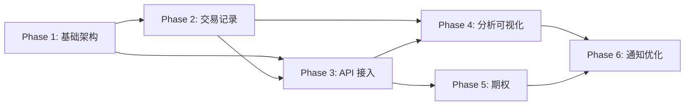

# TradeLens V2 — 实施路线图

> **版本**：2.0.0-draft  
> **日期**：2026-03-21

---

## 总览

V2 重构按 **6 个 Phase** 渐进式交付。每个 Phase 独立可用、独立部署。

```
Phase 1: 基础架构重构（~2 周）
    ↓
Phase 2: 交易记录与资金管理（~2 周）
    ↓
Phase 3: 交易所 API 接入（~3 周）
    ↓
Phase 4: 分析与可视化（~2 周）
    ↓
Phase 5: 期权模块（~2 周）
    ↓
Phase 6: 通知与优化收尾（~1 周）
```

**总预估**：~12 周（假设单人兼职开发）

---

## Phase 1: 基础架构重构

> **目标**：从单页面应用重构为多页面 Layout 架构，完成用户系统迁移

### 1.1 布局系统

| 任务           | 描述                                    | 优先级 |
| -------------- | --------------------------------------- | ------ |
| 可收缩侧边栏   | Linear 风格，展开/收缩状态持久化        | P0     |
| Header Bar     | 用户信息、通知、快捷操作                | P0     |
| 移动端底部导航 | <768px 响应式适配                       | P0     |
| 面包屑导航     | 页面层级指示                            | P1     |
| 多主题系统     | Light / Dark + 自定义主题，CSS 变量方案 | P0     |

### 1.2 路由结构

```
(auth)/login        → 登录页
(auth)/register     → 注册页
(dashboard)/        → Dashboard 首页
(dashboard)/portfolio       → 持仓列表
(dashboard)/portfolio/[sym] → 持仓详情
(dashboard)/calculator      → 波段计算器
(dashboard)/calculator/options → 期权分析
(dashboard)/ledger          → 交易账本
(dashboard)/ledger/funds    → 资金流水
(dashboard)/ledger/duplicates → 去重审核
(dashboard)/analytics       → 分析报表
(dashboard)/settings        → 设置
(dashboard)/settings/*      → 设置子页面
```

### 1.3 用户系统迁移

| 任务              | 描述                         |
| ----------------- | ---------------------------- |
| 移除 SMS 登录     | 删除阿里云短信相关代码       |
| 邮箱/密码注册登录 | Supabase Auth email/password |
| GitHub OAuth      | Supabase Auth OAuth provider |
| 登录/注册页面     | 独立的 (auth) Layout         |
| Auth 中间件       | 未登录重定向到 /login        |

### 1.4 数据库迁移

| 任务         | 描述                                                                                                  |
| ------------ | ----------------------------------------------------------------------------------------------------- |
| 新建 V2 表   | transactions, option_trades, fund_flows, corporate_actions, duplicate_candidates, notification_config |
| 扩展现有表   | profiles (新列), calculations (新列), api_keys (重建)                                                 |
| 迁移 V1 数据 | 将旧 transactions 数据填充 asset_class/exchange                                                       |
| RLS 策略     | 所有新表启用 RLS                                                                                      |

### 1.5 交付标准

- [x] 侧边栏导航可用，所有页面路由正常
- [x] 邮箱/密码 + GitHub 登录可用
- [x] 未登录自动跳转登录页
- [x] 多主题切换可用
- [x] 移动端适配正常
- [x] 数据库迁移完成，旧数据兼容

---

## Phase 2: 交易记录与资金管理

> **目标**：完成手动录入、资金流水、交易列表等核心数据管理功能

### 2.1 交易记录管理

| 任务         | 描述                                     | 优先级 |
| ------------ | ---------------------------------------- | ------ |
| 手动录入表单 | 支持股票 + Crypto 交易记录创建           | P0     |
| 交易列表页面 | 分页、排序、筛选（资产类别/交易所/时间） | P0     |
| 交易详情     | 单笔交易完整信息 + 编辑/删除             | P0     |
| 数据导入     | CSV/Excel 导入，提供模板下载             | P1     |
| 数据导出     | CSV/Excel/JSON 导出 + 筛选               | P0     |

### 2.2 资金流水

| 任务              | 描述             |
| ----------------- | ---------------- |
| 入金/出金记录表单 | 按交易所分别记录 |
| 资金流水列表      | 筛选/分页        |

### 2.3 手续费系统

| 任务             | 描述                           |
| ---------------- | ------------------------------ |
| 全局费率配置页面 | 美股/港股/Crypto/期权 四种模型 |
| 预设费率模板     | 主流券商/交易所费率预设        |
| 单笔费率覆盖     | 在交易录入时可覆盖全局费率     |

### 2.4 交付标准

- [x] 可手动录入、编辑、删除交易记录
- [x] 资金流水完整 CRUD
- [x] CSV/Excel 导入导出正常
- [x] 费率配置持久化生效

---

## Phase 3: 交易所 API 接入

> **目标**：接入 Longbridge + Binance + Bitget + OKX，实现自动同步

### 3.1 统一适配层

| 任务                     | 描述                                              |
| ------------------------ | ------------------------------------------------- |
| ExchangeAdapter 接口设计 | 统一的 fetchTrades/fetchDeposits/fetchWithdrawals |
| NormalizedTrade 类型     | 统一交易记录格式                                  |

### 3.2 交易所接入

| 交易所     | 认证方式                    | 接入内容                                     |
| ---------- | --------------------------- | -------------------------------------------- |
| Longbridge | OAuth 2.0                   | 交易记录 + 持仓 + 资金 + 公司行为 + 实时行情 |
| Binance    | API Key + HMAC              | 交易记录 + 持仓 + 充提记录 + 实时行情        |
| Bitget     | API Key + HMAC + Passphrase | 交易记录 + 持仓 + 充提记录 + 实时行情        |
| OKX        | API Key + HMAC + Passphrase | 交易记录 + 持仓 + 充提记录 + 实时行情        |

### 3.3 同步机制

| 任务             | 描述                                    |
| ---------------- | --------------------------------------- |
| 手动触发同步     | 「同步」按钮 → 调用 API → 写入数据库    |
| 自动同步（可选） | 定时器或 Cron Job 定期拉取              |
| 去重检测         | 模糊匹配算法，生成 duplicate_candidates |
| 去重审核界面     | 用户手动确认/合并/保留重复记录          |

### 3.4 API Key 管理

| 任务                  | 描述                            |
| --------------------- | ------------------------------- |
| API Key 管理页面      | 添加/修改/删除各交易所 API Key  |
| 加密存储              | AES-256 加密 API Secret         |
| 连接测试              | 「测试连接」按钮验证 Key 有效性 |
| Longbridge OAuth 流程 | 授权/回调/Token 刷新            |

### 3.5 Corporate Actions

| 任务              | 描述                         |
| ----------------- | ---------------------------- |
| 自动获取          | 通过 Longbridge API 定期检查 |
| 现金分红处理      | 记录金额，计入收益           |
| 股票分红/拆股处理 | 自动更新持仓数量和均价       |

### 3.6 交付标准

- [x] 四家交易所 API Key 配置可用
- [x] 手动触发同步正常
- [x] 去重检测和审核流程可用
- [x] 公司行为自动处理正确
- [x] 实时行情推送正常

---

## Phase 4: 分析与可视化

> **目标**：完成收益率计算、基准对比、全部图表

### 4.1 收益率计算引擎

| 任务                     | 描述                         |
| ------------------------ | ---------------------------- |
| 简单收益率               | (期末 - 期初) / 期初         |
| 时间加权收益率 (TWR)     | 消除资金流影响               |
| 金额加权收益率 (MWR/IRR) | 牛顿法求解 IRR               |
| 基准对比数据             | 拉取 S&P 500 和 QQQ 历史数据 |

### 4.2 图表实现

> 按优先级依次实现，所有图表支持 7 种时间维度切换

| 批次 | 图表                           | 优先级   |
| ---- | ------------------------------ | -------- |
| P0   | 累计 P&L 曲线                  | Phase 4a |
| P0   | 资产配置饼图                   | Phase 4a |
| P0   | 月度/年度收益柱状图            | Phase 4a |
| P0   | 收益率对比折线图（vs S&P/QQQ） | Phase 4a |
| P1   | 单标的收益走势图               | Phase 4b |
| P1   | 回撤曲线 (Drawdown)            | Phase 4b |
| P1   | 持仓成本 vs 市价对比图         | Phase 4b |
| P1   | 日历热力图                     | Phase 4b |
| P2   | 收益率瀑布图                   | Phase 4c |
| P2   | 波段价差雷达图                 | Phase 4c |
| P2   | 资金流入/流出趋势图            | Phase 4c |
| P2   | 手续费消耗分析图               | Phase 4c |

### 4.3 Dashboard KPI 卡片

| KPI        | 计算方式                    |
| ---------- | --------------------------- |
| 总资产净值 | Σ(持仓 × 市价) + 现金       |
| 总收益率   | TWR                         |
| 当日盈亏   | 今日市值变化                |
| 胜率       | 盈利交易数 / 总平仓交易数   |
| 盈亏比     | 平均盈利 / 平均亏损         |
| 最大回撤   | Max((Peak - Trough) / Peak) |
| 夏普比率   | (R_p - R_f) / σ_p           |

### 4.4 持仓管理

| 任务         | 描述                                     |
| ------------ | ---------------------------------------- |
| 持仓列表     | 分 Tab（股票/Crypto），整合/分交易所切换 |
| 持仓详情页   | 单标的历史交易 + 成本 vs 市价图          |
| 实时价格联动 | 持仓列表实时更新未实现盈亏               |

### 4.5 交付标准

- [x] 三种收益率计算正确
- [x] P0 图表全部可用
- [x] Dashboard KPI 数据准确
- [x] 时间维度切换正常
- [x] 持仓视图切换正常

---

## Phase 5: 期权模块

> **目标**：支持美股期权记录、分析和 Payoff 可视化

### 5.1 期权交易记录

| 任务          | 描述                                                      |
| ------------- | --------------------------------------------------------- |
| 期权录入表单  | Underlying + Type + Strike + Expiry + Premium + Contracts |
| 期权列表      | 按状态筛选（open/closed/exercised/expired）               |
| Greeks 追踪   | Delta/Gamma/Theta/Vega 展示                               |
| 到期/行权处理 | 自动状态转换 + 持仓更新                                   |

### 5.2 期权计算器

| 任务           | 描述                                 |
| -------------- | ------------------------------------ |
| Payoff Diagram | 基于 Strike + Premium 的到期盈亏曲线 |
| 保本价计算     | 考虑佣金和合约费                     |
| 当前市价估值   | 基于实时标的价格的理论价值           |

### 5.3 波段计算器扩展

| 任务           | 描述                                 |
| -------------- | ------------------------------------ |
| 资产类别选择器 | 计算器支持切换：Crypto / 美股 / 港股 |
| 手续费模型联动 | 根据资产类别自动载入对应费率模型     |
| 多价位试算     | 输入多个目标价，输出每个价位的 P&L   |

### 5.4 交付标准

- [x] 期权 CRUD 正常
- [x] 到期/行权自动处理正确
- [x] Payoff Diagram 渲染正确
- [x] 波段计算器多资产类别切换正常

---

## Phase 6: 通知与收尾优化

> **目标**：Bark 推送、性能优化、最终打磨

### 6.1 Bark 推送

| 任务          | 描述                               |
| ------------- | ---------------------------------- |
| Bark 配置界面 | Server URL + Device Key + 阈值设置 |
| 推送触发逻辑  | 投资组合涨跌幅 / 同步完成通知      |
| 推送记录      | 历史通知记录查看                   |

### 6.2 性能优化

| 任务            | 描述                        |
| --------------- | --------------------------- |
| 图表懒加载      | React.lazy + Suspense       |
| 数据分页        | 大列表虚拟滚动或分页        |
| 缓存策略        | SWR / React Query 优化      |
| 复杂计算 Worker | TWR/IRR 计算放入 Web Worker |

### 6.3 质量保障

| 任务         | 描述                  |
| ------------ | --------------------- |
| 单元测试     | 计算引擎 100% 覆盖    |
| 集成测试     | API Routes 关键路径   |
| E2E 测试     | Playwright 核心用户流 |
| i18n 完整性  | 所有页面双语校验      |
| 可访问性检查 | 基础 WCAG 合规        |

### 6.4 交付标准

- [x] Bark 推送功能可用
- [x] 所有页面性能达标（首屏 <2s）
- [x] 测试覆盖率 >80%
- [x] 全部 i18n 文案到位
- [x] 文档同步更新

---

## Phase 7: 自动化与生态集成

> **目标**：减少手动操作，实现全自动对账与更多券商接入

### 7.1 定时同步 (Automated Sync)

- [x] 重构适配器工厂与注册表 (adapter-factory.ts)
- [x] 实现 SyncManager 核心逻辑与同步历史记录
- [x] 实现基于 Cron 的多用户批量同步逻辑
- [x] 增加同步状态监控 (SyncHistory 页面 & Header 指示器)

---

## 依赖关系图



---

## 风险与缓解

| 风险                   | 影响       | 缓解措施                          |
| ---------------------- | ---------- | --------------------------------- |
| Longbridge API 变更    | 接口不兼容 | SDK 版本锁定 + 适配层解耦         |
| Bitget/OKX API 限流    | 同步失败   | 指数退避重试 + 分页拉取           |
| 期权 Greeks 数据不可靠 | 分析偏差   | 标注数据来源，提供手动输入        |
| 汇率 API 免费额度不足  | 汇率过期   | 降级为日级数据 + 本地缓存         |
| 数据量增长             | 查询变慢   | 分页 + 索引优化（单用户无需分表） |
